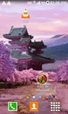

Proyecto Final - Study Jam II 2016
===

    

        
    

Repositorio Proyecto Final del Study Jam Android Development for Beginners II 2016, llevado a cabo en la ciudad de La Paz, Bolivia a cargo del <a target="_blank" href="http://www.gdg.androidbolivia.com">GDG Android Bolivia</a> .

Nombre Aplicación.
---
El nombre de la aplicación es: Arbol de Villancicos

Objetivo
---
reproducir las canciones de villancicos mas conocidos

Caracteristicas
---
* 7 temas de villancicos (Con opción activar/desactivar).

Wireframes
---
Puedes visualizar los Wireframes de este proyecto.

https://ninjamock.com/Designer/Workplace/4770620

Compatibilidad
---
Esta aplicación es compatible con versiones de Android 4.0.3 o superior.

Uso
---------
Para probar este ejemplo clona este repositorio de la siguiente forma:
>
>     $ git clone https://github.com/Gusn8/ProyectoFinal_StudyJam.git

Luego de ello dentro de Android Studio:

* File --> New --> Import Project
* Seleccionas la ruta donde hiciste el `clone` del proyecto.
* Build --> Rebuild Project
* Run

Corrida previa
---
Aca te muestro cual es el funcionamiento de mi aplicación a grandes rasgos.

    

        <table border="0">
            <tr>
                <td></td>

            </tr>
        </table>
    

 

Descripción técnica
---
En este proyecto de utilizáron los siguientes componentes tanto en el `diseño` como en la `funcionalidad`:

**`Vista:`**
* LinearLayout (Horizontal) para la alineación de las esferas.
* RelativeLayout, para la alineación de las vistas principales.
* ToggleButtons, para activar y/o desactivar el sonido en la aplicación.
* EditTexts, para recabar información acerca de los nombres de las personas.
* ImageView, para el logo del SplashScreen.
* Alpha, Rotate y Scale para las animaciones de SplashScreen.
.
.

**`Funcionalidad:`**
* MediaPlayer, para reproducir la canción de villancicos de la app.
* Animacion, para la animacion de intro.

.
.
.

Autor
---
Gyery Castaño Apaza
[Github](https://www.github.com/rygo) 
